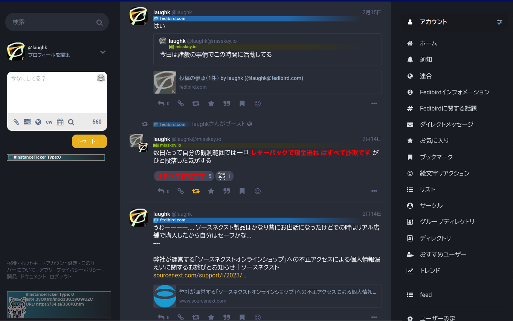
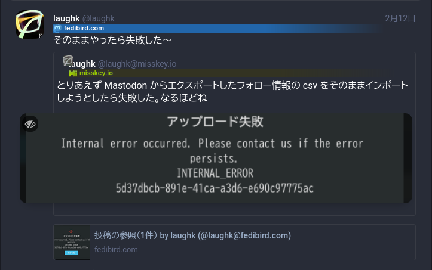
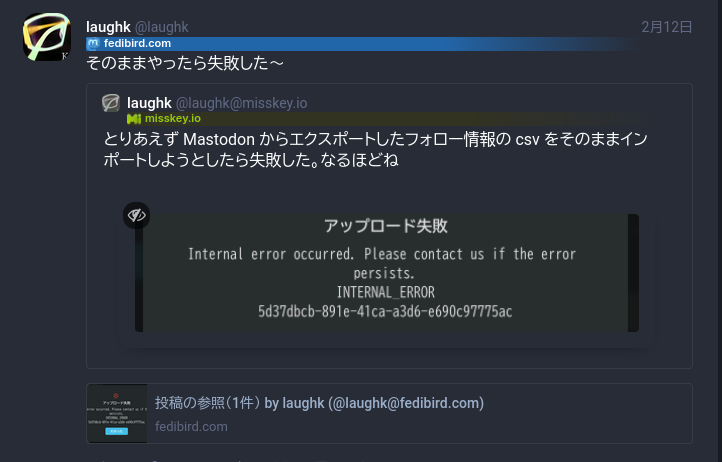
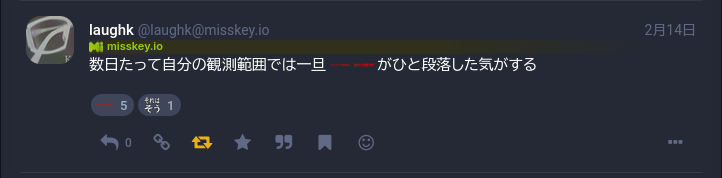
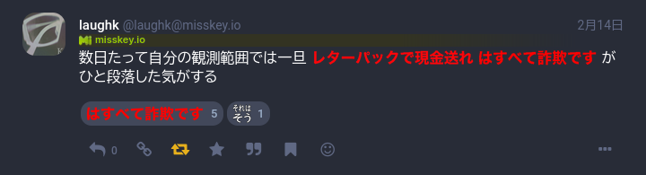

# adjust-fedibird-modern-theme

fedibird.com のモダンテーマ（ダーク・ライト共通）のデザインを調整する stylus

## ⚠ 注意

基本的に作者が fedibird.com を使いやすくすることを目的としているため、このスタイルを適用して発生する一切の事象に作者は責任を持てません。自己責任のもとでご利用ください。

## この userstyle でやること

このスタイルでは fedibird.com のモダンテーマそのままでは見づらい、使いづらいと作者が感じている部分を以下のとおりに修正するものです

- アクションボタンのテキストを常時非表示にします
- 引用に含まれる投稿の表示を調整します
    - 引用されたユーザー情報の表示位置（アイコン、インスタンス名）を調整
    - 画像をはみ出ないようにサイズ調整
    - テキストと境界の余白を調整
- misskey.io などで使われる横に長い絵文字が圧縮されないように調整

## 使い方

1. ブラウザ拡張 stylus を導入してください
    - 公式: [openstyles/stylus: Stylus - Userstyles Manager](https://github.com/openstyles/stylus/)
    - Chrome: [Stylus - Chrome ウェブストア](https://chrome.google.com/webstore/detail/stylus/clngdbkpkpeebahjckkjfobafhncgmne)
    - Firefox: [Stylus – 🦊 Firefox (ja) 向け拡張機能を入手](https://addons.mozilla.org/ja/firefox/addon/styl-us/)
2. UserStyles.world の以下のページの「Install」から導入してください
    - [Adjust-fedibird-modern-theme — UserStyles.world](https://userstyles.world/style/8654/adjust-fedibird-modern-theme)

⚠前提として、fedibird.com にて「ユーザー設定」→「外観」にある「サイトテーマ」から「モダン（ダーク）」または「モダン（ライト）」を選択している必要があります。

## 調整内容の詳細

### アクションボタンのテキスト非表示

#### 調整前

#### 調整後

- 常時テキストを非表示にします

### 引用に含まれる投稿の表示調整

#### 調整前

#### 調整後

- 引用元アカウント情報のアイコンと名前, id の被りを解消します
- 引用テキストと境界の隙間を調整します
- 引用している画像が枠に収まるように調整をします

### misskey.io などで使われる横に長い絵文字が圧縮されないようにする調整

#### 調整前

#### 調整後

## License

MIT License

----

## What's this userstyle do?

This style fixes the following areas of the fedibird.com modern theme that the author feels are difficult to see and use

- Hide the text of the action buttons at all times
- Adjust the display of posts included in quotes
    - Adjust display position (icon, instance name) of quoted user information
    - Adjust the size of images so they do not overflow
    - Adjust text and border margins
- Adjust to avoid compression of long horizontal emojis used in misskey.io, etc.

(Translated with www.DeepL.com/Translator)
